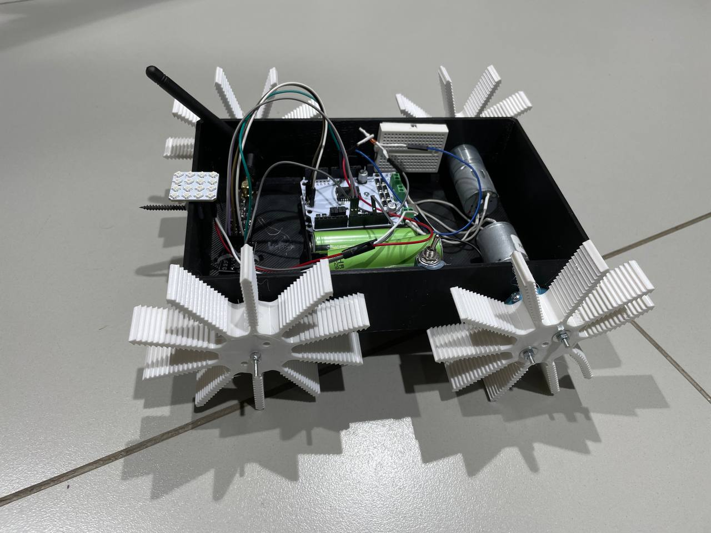
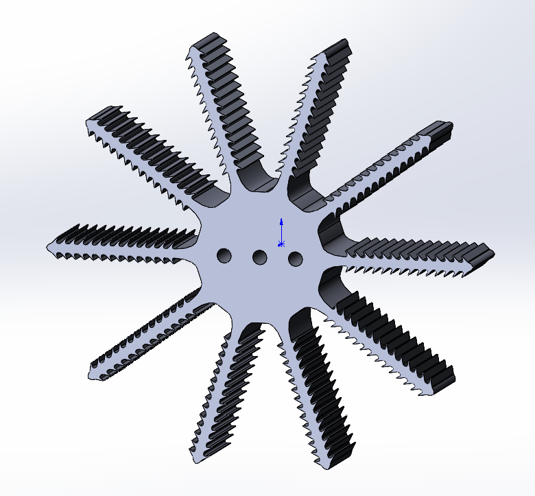
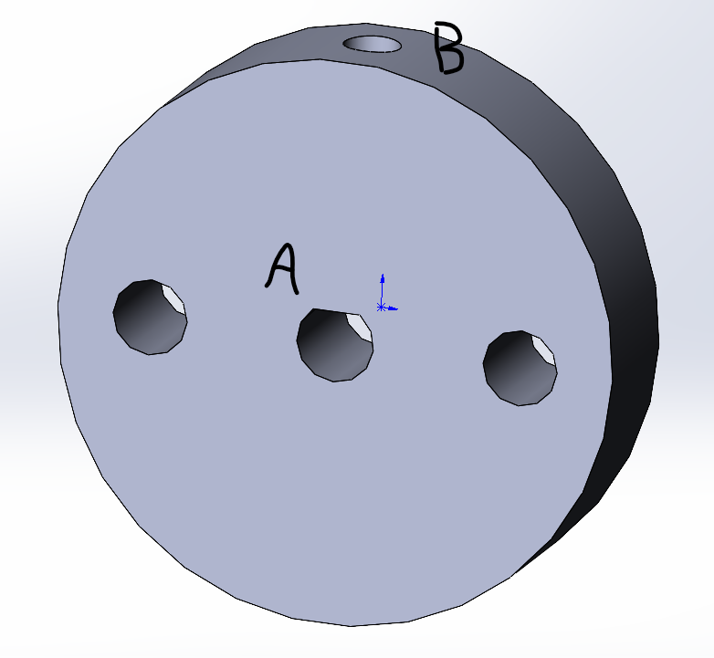
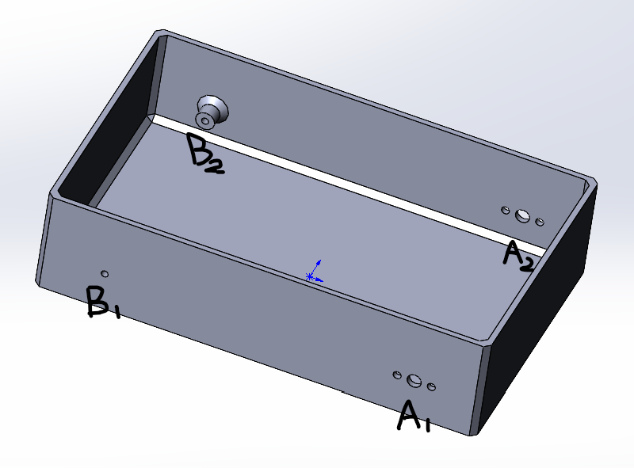

# Rayan Gosling Car

Ниже описан процесс разработки радиоуправляемой машины (в дальнейшем - устройство) для прохождения полосы препятствий в рамках Fab Bots 2024.

## Общий концепт

Так как сроки на изготовление устройства были весьма сжатые, было принято решение максимально упростить конструкцию. Устройство представляет из себя тележку на четырех колесах, приспособленных для преодоления препятствий.



## 3D-моделирование

Колеса были спроектированы под печать из TPU. Они представляют собой круги с гибкими жгутами, повыщающими сцепление при прохождении полосы препятствий:



Для надежного крепления ведущих колес на оси моторов были спроектированы муфты. Ось мотора продевается в отверстие A, а затем фиксируется прижимным винтом через отверстие B. После чего колесо крепится к муфте на два оставшихся отверстия:



Курпус был так же смоделирован для печати на 3D-принтере. Моторы с ведущими колесами крепятся в точках A1 и A2, а оси ведомой пары колес крепятся в точках B1 и B2:



## Сборка

Сборка устройства осуществлялась с помощью термоклея и винтов M3. На термоклей была закреплена электроника и шуруп для прокола шара.

## Утяжелители

Для улучшения сцепления в корпус устройства были помещены утяжелители - пакеты с винтами.

## Программирование

Код для пульта управления:

```C++
#include <RF24.h>
#include <SPI.h>
#include <nRF24L01.h>

#define JOY_X_PIN A0
#define JOY_Y_PIN A1
#define JOY_BUTTON_PIN 2

#define JOY_X_ORIGIN 512
#define JOY_Y_ORIGIN 512

struct controls_state {
  int joy_x_axis = 0;
  int joy_y_axis = 0;
  bool joy_button = 0;
  bool joy_x_direction = 0;
  bool joy_y_direction = 0;
} cstate;

void joy_init() {
  pinMode(JOY_X_PIN, INPUT);
  pinMode(JOY_Y_PIN, INPUT);
  pinMode(JOY_BUTTON_PIN, INPUT_PULLUP);
}

void joy_update() {
  int x = analogRead(JOY_X_PIN) - JOY_X_ORIGIN;
  int y = analogRead(JOY_Y_PIN) - JOY_Y_ORIGIN;

  cstate.joy_x_axis = x;
  cstate.joy_y_axis = y;

  cstate.joy_button = digitalRead(JOY_BUTTON_PIN);
}

void joy_dump() {
  Serial.println("Directon vector is (" + String(cstate.joy_x_axis) + ", " +
                 String(cstate.joy_y_axis) + "), button state is " +
                 String(cstate.joy_button));
}

#define RADIO_CE 8
#define RADIO_CSN 9
#define RADIO_CHANNEL 13
#define RADIO_TRUBA 0x1234567890LL
#define RADIO_DATA_RATE RF24_1MBPS
#define RADIO_POWER RF24_PA_HIGH

#define RADIO_CONNECTION_PIN 3
#define RADIO_DATARATE_PIN 4

RF24 radio(RADIO_CE, RADIO_CSN);

void radio_init() {
  pinMode(RADIO_CONNECTION_PIN, OUTPUT);
  pinMode(RADIO_DATARATE_PIN, OUTPUT);

  radio.begin();

  if (!radio.isChipConnected()) {
    digitalWrite(RADIO_CONNECTION_PIN, LOW);
    Serial.println("11111");
    for (;;)
      ;
  } else {
    digitalWrite(RADIO_CONNECTION_PIN, HIGH);
  }

  radio.begin();
  radio.setChannel(RADIO_CHANNEL);
  radio.setDataRate(RADIO_DATA_RATE);
  radio.setPALevel(RADIO_POWER);
  radio.openWritingPipe(RADIO_TRUBA);
}

void radio_send_cstate() {
  if (radio.write(&cstate, sizeof(controls_state))) {
    digitalWrite(RADIO_DATARATE_PIN, HIGH);
  } else {
    digitalWrite(RADIO_DATARATE_PIN, LOW);
  }
}

void setup() {
  Serial.begin(9600);
  joy_init();
  radio_init();
}
void loop() {
  delay(10);

  joy_update();
  joy_dump();

  radio_send_cstate();
}
```

Код для устройства:

```C++
#include <RF24.h>
#include <SPI.h>
#include <nRF24L01.h>

#include <Adafruit_NeoPixel.h>

struct controls_state {
  int joy_x_axis = 0;
  int joy_y_axis = 0;
  bool joy_button = 0;
  bool joy_x_direction = 0;
  bool joy_y_direction = 0;
} cstate;

#define RADIO_CE 8
#define RADIO_CSN 9
#define RADIO_CHANNEL 13
#define RADIO_TRUBA 0x1234567890LL
#define RADIO_TRUBA_NUMBER 1
#define RADIO_DATA_RATE RF24_1MBPS
#define RADIO_POWER RF24_PA_HIGH

#define RADIO_CONNECTION_PIN 3
#define RADIO_DATARATE_PIN 4

RF24 radio(RADIO_CE, RADIO_CSN);

#define LED_MODULE_PIN 10
#define CLUSTER_COUNT 16

Adafruit_NeoPixel matrix =
    Adafruit_NeoPixel(CLUSTER_COUNT, LED_MODULE_PIN, NEO_RGB + NEO_KHZ800);

void radio_init() {
  radio.begin();

  if (!radio.isChipConnected()) {
    // digitalWrite(RADIO_CONNECTION_PIN, LOW);
    Serial.println("11111");
  } else {
    // digitalWrite(RADIO_CONNECTION_PIN, HIGH);
  }

  radio.setChannel(RADIO_CHANNEL);
  radio.setDataRate(RADIO_DATA_RATE);
  radio.setPALevel(RADIO_POWER);
  radio.openReadingPipe(RADIO_TRUBA_NUMBER, RADIO_TRUBA);
  radio.startListening();
}

void radio_fetch() {
  if (radio.available()) {
    radio.read(&cstate, sizeof(cstate));
    // digitalWrite(RADIO_DATARATE_PIN, HIGH);
  } else {
    // digitalWrite(RADIO_DATARATE_PIN, LOW);
  }
}

void joy_dump() {
  Serial.println("Directon vector is (" + String(cstate.joy_x_axis) + ", " +
                 String(cstate.joy_y_axis) + "), button state is " +
                 String(cstate.joy_button));
}

void matrix_set(int value) {
  for (int i = 0; i != 16; ++i) {
    matrix.setPixelColor(i, matrix.Color(value, value, value));
  }
  matrix.show();
}

void setup() {
  Serial.begin(9600);

  radio_init();

  pinMode(5, OUTPUT);
  pinMode(6, OUTPUT);

  pinMode(4, OUTPUT);
  pinMode(7, OUTPUT);

  matrix.begin();
  matrix_set(0);
}

void loop() {
  radio_fetch();

  long long l = (long long)sqrt(
      (long long)cstate.joy_x_axis * (long long)cstate.joy_x_axis +
      (long long)cstate.joy_y_axis * (long long)cstate.joy_y_axis);

  long long x = min(l / 2ll, 255);
  if (x < 32) {
    x = 0;
  }

  long long balance = cstate.joy_y_axis / 4ll + 128ll;
  if (abs(balance - 128) < 32) {
    balance = 128;
  }

  int l_wheel = (int)(x * balance / 128ll);
  int r_wheel = (int)(x * (255 - balance) / 128ll);

  bool x_dir = false;
  if (cstate.joy_x_axis < -128) {
    x_dir = true;
  }

  analogWrite(5, l_wheel);
  analogWrite(6, r_wheel);

  if (x_dir) {
    digitalWrite(7, HIGH);
    digitalWrite(4, HIGH);
  } else {
    digitalWrite(7, LOW);
    digitalWrite(4, LOW);
  }

  if (cstate.joy_button) {
    matrix_set(255);
    delay(500);
    matrix_set(0);
  }

  Serial.print(String(cstate.joy_x_axis) + ", " + String(cstate.joy_y_axis) +
               "    ");
  Serial.println(String(l_wheel) + ", " + String(r_wheel) + ", ");
}
```
